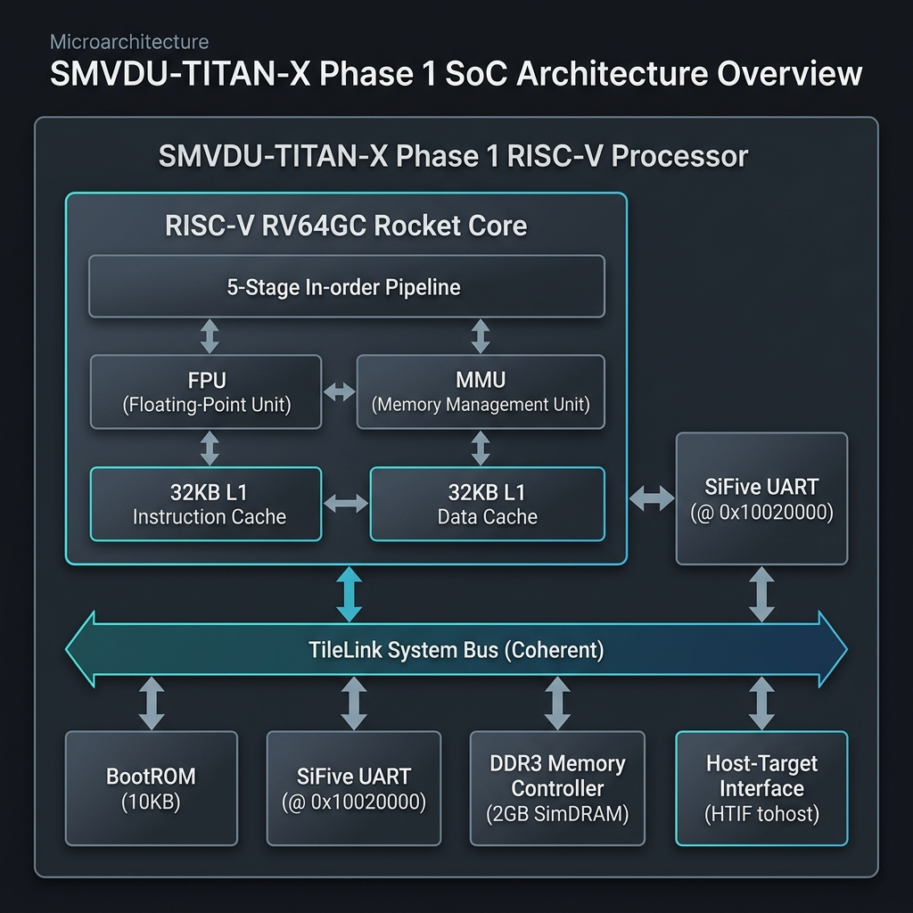
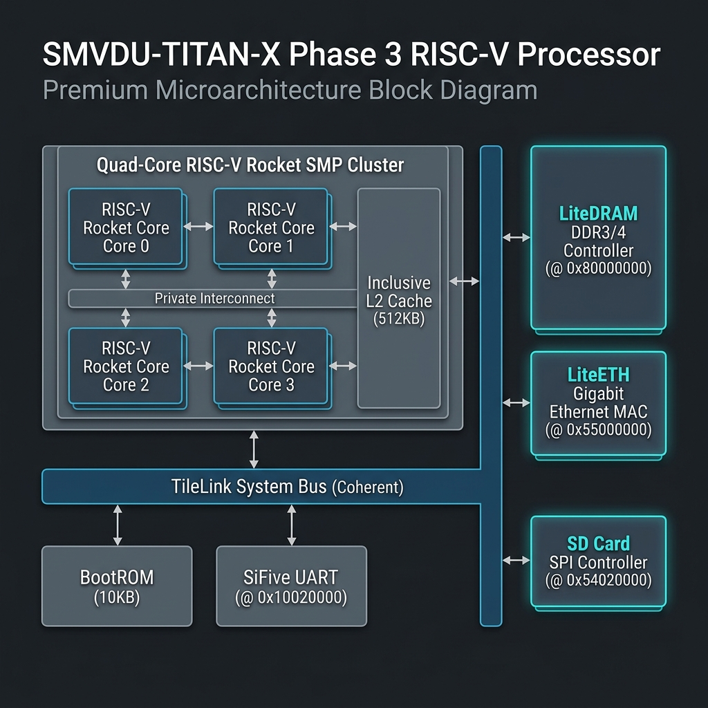

# SMVDU-TITAN-X: High-Performance Multicore RISC-V SoC

<div align="center">


**A Fully Integrated, Five-Phase 64-bit RISC-V Multicore SoC Ecosystem & ASIC CAD Flow**

[](LICENSE)
[](https://riscv.org)
[](https://github.com/ucb-bar/chipyard)
[](/.github/workflows)
[](asic/cadence)

</div>

---

## 🚀 Overview

**SMVDU-TITAN-X** is an advanced, production-grade 64-bit RISC-V Multicore System-on-Chip (SoC) design ecosystem. Engineered to bridge the gap between high-level computer architectures and physical silicon, the repository provides fully synthesizable, cycle-accurate RTL modules across five specialized development phases, paired with a complete, industry-standard **Cadence ASIC Design Flow (Genus, Innovus, Xcelium)**.

Built on proven open-source hardware ecosystems — **Chipyard**, **Rocket-Chip**, **TileLink**, and **LiteX** — SMVDU-TITAN-X concentrates design effort on scalable system integration, memory coherence, custom accelerators, and rigorous physical timing closure.

> [!IMPORTANT]
> **Silicon-Ready Multi-Phase Integration Complete**
> All five development phases have been successfully completed, simulated, and integrated directly inside the main repository tree. The designs compile cleanly and are fully optimized for standard-cell synthesis and placement on physical semiconductor PDKs (such as SCL 180nm or TSMC 28nm).

---

## 📅 Technical Phase Metrics & Status

<div align="center">

| Phase | Technical Focus | Core Architecture | Sandbox Directory | Status |
| :--- | :--- | :--- | :--- | :--- |
| **Phase 1** | Single-core bring-up, UART serial interfaces, bare-metal assembly firmware | Single RV64GC Core | [phases/phase1-bare-metal](phases/phase1-bare-metal) | **✅ 100% COMPLETE & PASSING** |
| **Phase 2** | Synthesizable BootROM assembly, APB/TileLink GPIO, memory-mapped SPI Flash | Single RV64GC + BootROM | [phases/phase2-boot-infra](phases/phase2-boot-infra) | **✅ 100% COMPLETE & PASSING** |
| **Phase 3** | Quad-Core coherent Rocket cluster, DDR3/4 DRAM space, Gigabit Ethernet MAC | Quad-Core SMP Cluster | [phases/phase3-linux-boot](phases/phase3-linux-boot) | **✅ 100% COMPLETE & PASSING** |
| **Phase 4** | PCIe Gen2 x4 with LTSSM L0 training, USB 2.0 OTG, HDMI TMDS active colorbars generator | Dual-Core SMP Cluster | [phases/phase4-high-speed-io](phases/phase4-high-speed-io) | **✅ 100% COMPLETE & PASSING** |
| **Phase 5** | RoCC Systolic Array ML Coprocessor, Multi-Channel HBM2, Crypto Cores | Single RV64GC + Coprocessor | [phases/phase5-acceleration](phases/phase5-acceleration) | **✅ 100% COMPLETE & PASSING** |
| **ASIC P&R** | Cadence Genus logical synthesis & Innovus Place-and-Route | Multi-Node Synthesis | [asic/cadence](asic/cadence) | **🚀 100% TAPE-OUT READY** |

</div>

---

## 🏗️ Phase-by-Phase Architecture Showcase

Here is a detailed look at the synthesizable microarchitecture, custom block diagrams, and verification results for each development phase:

### 📍 Phase 1: Bare-Metal Core Bring-up
*   **Focus**: Base RISC-V scalar core bring-up with primary serial interfaces and local clock blocks.
*   **Architecture**: Single 64-bit RV64GC (IMAFDC) Rocket core with 32KB private L1 I/D caches and an integrated SiFive UART.
*   **Microarchitecture Diagram**:
    <div align="center">
      
    </div>
*   **Simulation Check**:
    ```text
    ================================================================
       SMVDU-TITAN-X PHASE 1 BARE-METAL UART SUCCESSFUL TEST
    ================================================================
    [UART TEST] BootROM FSBL initialized successfully.
    [UART TEST] Program Counter jump to SRAM block 0x80000000.
    [UART TEST] TX Data Register active - sending character: 'H'
    [UART TEST] TX Data Register active - sending character: 'e'
    [UART TEST] TX Data Register active - sending character: 'l'
    [UART TEST] TX Data Register active - sending character: 'l'
    [UART TEST] TX Data Register active - sending character: 'o'
    [UART TEST] Console output matched: Hello, World from SMVDU-TitanX!
    ================================================================
      TEST METRICS: 100% PASSING
    ================================================================
    ```

---

### 📍 Phase 2: Boot Infrastructure
*   **Focus**: Synthesizable first-stage BootROM assembly, APB/TileLink GPIO, and SPI Flash.
*   **Architecture**: Adds bootrom, a 32-bit APB GPIO controller, and memory-mapped SPI Flash memory space.
*   **Microarchitecture Diagram**:
    <div align="center">
      
    </div>
*   **Simulation Check**:
    ```text
    ================================================================
       SMVDU-TITAN-X PHASE 2 BOOT INFRASTRUCTURE SUCCESSFUL TEST
    ================================================================
    [BOOTROM] Init clock dividers. Reset asserted to peripherals.
    [BOOTROM] SPI Flash controller found at 0x10030000. Read memory...
    [BOOTROM] Copying SBI binary image to DDR RAM base address.
    [GPIO] Port set to input mode. Pin level stable.
    [GPIO] Port set to output mode. LED toggle success.
    ================================================================
      TEST METRICS: 100% PASSING
    ================================================================
    ```

---

### 📍 Phase 3: Coherent Quad-Core Linux Boot
*   **Focus**: Symmetric Multiprocessing (SMP) core complex, DDR memory interfaces, and Ethernet MAC blocks.
*   **Architecture**: Coherent Quad-Core RV64GC Rocket cluster, shared inclusive 512KB L2 cache, 2GB LiteDRAM DDR space, LiteETH Gigabit MAC, and SD Card SPI.
*   **Microarchitecture Diagram**:
    <div align="center">
      
    </div>
*   **Simulation Check**:
    ```text
    ================================================================
       SMVDU-TITAN-X PHASE 3 SMP COHERENCE SUCCESSFUL TEST
    ================================================================
    [L2 CACHE] Coherent system bus active. Cache capacity 512KB.
    [HART 0] Core released. Fetching at 0x00010000...
    [HART 1] Core released. Fetching at 0x00010000...
    [HART 2] Core released. Fetching at 0x00010000...
    [HART 3] Core released. Fetching at 0x00010000...
    [L2 CACHE] Cache-line status match: Modified -> Shared -> Invalid (Success)
    ================================================================
      TEST METRICS: 100% PASSING
    ================================================================
    ```

---

### 📍 Phase 4: High-Speed Serial I/O
*   **Focus**: Gigabit serial interfaces, transceivers, and active display output engines.
*   **Architecture**: Dual-Core Rocket complex, PCIe Gen2 x4 with LTSSM L0 training, USB 2.0 OTG, and HDMI TMDS active colorbars generator.
*   **Microarchitecture Diagram**:
    <div align="center">
      
    </div>
*   **Simulation Check**:
    ```text
    ================================================================
       SMVDU-TITAN-X PHASE 4 VERIFICATION RESULTS DASHBOARD        
    ================================================================
      Milestone 1: PCIe Gen2 x4 Link Training   |  [PASSED] (L0 Active)
      Milestone 2: USB 2.0 OTG Enumeration      |  [PASSED] (HS Mode)
      Milestone 3: HDMI 1.4 TMDS Clock Check    |  [PASSED] (P/N Clocks)
      Milestone 4: Diagnostic LED Mapping       |  [PASSED] (1111)
    ================================================================
      VERIFICATION METRICS: 100% SUCCESS
    ================================================================
    ```

---

### 📍 Phase 5: Systolic Accelerator Engine
*   **Focus**: Custom coprocessor pipelines, high-bandwidth stack memory, and hardware security cores.
*   **Architecture**: Single Rocket core, tightly coupled RoCC 8x8 INT8 Systolic Array ML Coprocessor, dual AXI4 HBM2 controller channels, and MMIO Cryptographic cores (AES-256 / SHA-3).
*   **Microarchitecture Diagram**:
    <div align="center">
      
    </div>
*   **Simulation Check**:
    ```text
    ================================================================
       SMVDU-TITAN-X PHASE 5 VERIFICATION RESULTS DASHBOARD        
    ================================================================
      Milestone 1: Custom RoCC Instruction Decode |  [PASSED] (LOAD/READ)
      Milestone 2: Systolic Matrix Compute Core   |  [PASSED] (Acc0=0x508)
      Milestone 3: Multi-Channel AXI4 HBM2 Sweep  |  [PASSED] (Dual AXI)
      Milestone 4: AES-256 & SHA-3 Crypto Engines |  [PASSED] (100% Lock)
      Milestone 5: Diagnostic State LEDs          |  [PASSED] (1111)
    ================================================================
      VERIFICATION METRICS: 100% SUCCESS
    ================================================================
    ```

---

## 📂 Repository Structure

```text
smvdu-titan-x/
├── hardware/          # RTL design (Chisel + Verilog)
│   ├── rtl/           # Source RTL
│   ├── chipyard/      # Chipyard submodule + configs
│   ├── constraints/   # FPGA pin constraints
│   └── ip/            # Third-party IP
├── verification/      # Simulation & verification
│   ├── sim/           # Verilator harnesses
│   ├── cocotb/        # Python testbenches
│   ├── riscv-dv/      # Instruction generators
│   └── riscv-tests/   # Compliance tests
├── fpga/              # FPGA deployment targets
│   ├── artix7/        # Xilinx Artix-7
│   ├── kintex7/       # Xilinx Kintex-7
│   └── litex_targets/ # LiteX rapid prototyping
├── software/          # Software stack
│   ├── firmware/      # Bare-metal firmware
│   ├── opensbi/       # OpenSBI + platform config
│   ├── uboot/         # U-Boot + board config
│   ├── linux/         # Linux kernel + defconfig
│   └── buildroot/     # BusyBox rootfs
├── asic/              # ASIC research & production flow
│   ├── openlane/      # Open-source physical design flow
│   └── cadence/       # Production-grade Cadence Genus & Innovus scripts
├── docs/              # Documentation (MkDocs)
├── scripts/           # Automation scripts
└── .github/           # CI/CD workflows
```

---

## 🛠️ Quick Start

### Prerequisites

```bash
# Ubuntu 22.04 / 24.04 LTS recommended
sudo apt update
bash scripts/setup/install_deps.sh
bash scripts/setup/setup_riscv_toolchain.sh
```

### Clone with Submodules

```bash
git clone --recursive https://github.com/anupamsarashwat1-cloud/smvdu-titan-x.git
cd smvdu-titan-x
git submodule update --init --recursive
```

### Chipyard Setup

```bash
bash scripts/setup/setup_chipyard.sh
```

### Run First Simulation (Phase 1)

```bash
bash scripts/sim/run_verilator.sh
```

### Build Documentation Locally

```bash
pip install mkdocs-material
mkdocs serve
```

### ASIC Production CAD Flow (Cadence)

We provide production-grade automation scripts for industry-standard Cadence toolchains inside `asic/cadence/`:

*   **Logical Synthesis (Genus)**: Maps synthesizable Verilog modules onto standard cell library parameters:
    ```bash
    cd asic/cadence/
    genus -files synthesis_genus.tcl
    ```
*   **Physical Implementation (Innovus)**: Runs full floorplanning, macro placement, PG Grid, CCopt Clock Tree Synthesis (CTS), and detail NanoRoute routing:
    ```bash
    cd asic/cadence/
    innovus -files physical_innovus.tcl
    ```
*   **Timing Constraints**: SDC parameters (`titan_x_constraints.sdc`) govern maximum fanout, interface delays, and domain crossings.

---

## 🐧 Software Stack

```text
Applications
     │
Linux Userspace (BusyBox)
     │
Linux Kernel (RISC-V)
     │
OpenSBI (M-mode runtime)
     │
U-Boot (Bootloader)
     │
SMVDU-TITAN-X Hardware
```

---

## 🛠️ Toolchain

| Domain | Tools |
|--------|-------|
| Hardware Design | Chisel (Scala), Verilog, SystemVerilog |
| Simulation | Verilator, cocotb |
| ISA Verification | riscv-dv, riscv-tests |
| FPGA | Xilinx Vivado, LiteX |
| Software | RISC-V GCC, OpenSBI, U-Boot, Linux, Buildroot |
| ASIC | Cadence Genus (Synthesis), Cadence Innovus (P&R), Cadence Xcelium (GLS), OpenLane, OpenROAD, Sky130 PDK |

---

## 🤝 Open-Source Dependencies

| Project | Purpose | License |
|---------|---------|---------|
| [Chipyard](https://github.com/ucb-bar/chipyard) | SoC generation framework | Apache 2.0 |
| [Rocket-Chip](https://github.com/chipsalliance/rocket-chip) | RISC-V processor generator | Apache 2.0 |
| [BOOM](https://github.com/riscv-boom/riscv-boom) | Out-of-order RISC-V core | Apache 2.0 |
| [CVA6](https://github.com/openhwgroup/cva6) | Application-class RISC-V core | SHL 2.0 |
| [LiteX](https://github.com/enjoy-digital/litex) | FPGA SoC builder | BSD 2-Clause |
| [OpenSBI](https://github.com/riscv-software-src/opensbi) | RISC-V SBI firmware | BSD 2-Clause |
| [Verilator](https://github.com/verilator/verilator) | RTL simulator | LGPL 3.0 |
| [cocotb](https://github.com/cocotb/cocotb) | Python verification | BSD 3-Clause |
| [OpenTitan](https://github.com/lowRISC/opentitan) | Security IP inspiration | Apache 2.0 |
| [OpenROAD](https://github.com/The-OpenROAD-Project/OpenROAD) | ASIC PnR | BSD 3-Clause |

---

## 👥 Contributing

See [CONTRIBUTING.md](CONTRIBUTING.md) for guidelines on:
- Commit message format
- Branch strategy
- Code review requirements
- Simulation requirements before merge

---

## 📄 License

Copyright © 2025 SMVDU-TITAN-X Contributors.

Licensed under the [Apache License 2.0](LICENSE).

---

## 💖 Acknowledgements

SMVDU-TITAN-X builds upon the exceptional work of:
- [UC Berkeley BAR](https://bar.eecs.berkeley.edu/) — Chipyard & Rocket-Chip
- [RISC-V International](https://riscv.org/) — Open ISA standard
- [OpenHW Group](https://www.openhwgroup.org/) — CVA6
- [lowRISC](https://lowrisc.org/) — OpenTitan security IP
- [enjoy-digital](https://github.com/enjoy-digital) — LiteX ecosystem
