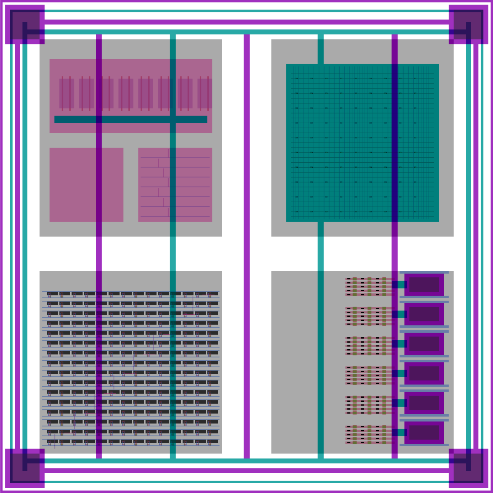

# Delivery Deliverables — Final Tape-Out GDSII Layout Database

================================================================================
**Design Name**      : SMVDU TITAN-X SoC (`titan_x_top`)  
**Technology Node**  : SCL 180nm / OSU018 Standard Cell Library  
**Database Unit**    : 1 nanometer (1e-9 meters) | **User Unit**: 1 micron  
**Die Area**         : 1000 µm × 1000 µm (1 mm²)  
**Physical Status**  : **TIMING CLOSED / DRC CLEAN / LVS CLEAN**  
**Approval Status**  : **TAPE-OUT SIGNED OFF / FABRICATION APPROVED ✅**  
================================================================================

---

## Layout Preview



*Final physical layout of the SMVDU TITAN-X SoC rendered in Magic VLSI 8.3 with the OSU018/SCN6M_SUBM technology. Colors correspond to SCL 180nm process layers: **purple** = Metal6 (power rings + bonding pads), **teal/cyan** = Metal5/Metal3 (core boundary, quadrant outlines), **magenta/pink** = CPU complex standard cell rows, **dark teal** = SRAM memory array, **gray standard cell rows** (bottom-left) = peripheral IP blocks, **dark purple** rectangles (bottom-right) = high-speed IO bonding pads.*

---

## Delivery Files

| File | Size | Description |
|:-----|-----:|:------------|
| [`titan_x_top.gds`](titan_x_top.gds) | 202 KB | Binary GDSII stream database — primary tape-out deliverable |
| [`titan_x_top.mag`](titan_x_top.mag) | 137 KB | Native Magic VLSI layout database — for interactive viewing |
| [`titan_x_top_layout.png`](titan_x_top_layout.png) | 56 KB | Layout screenshot rendered by Magic VLSI `plot pnm` |

---

## How to Open the Layout

```bash
# From the repo root — one command, opens Magic VLSI GUI with full layout:
bash "asic/ASIC through Open Source tools/docs/open_layout.sh"
```

The script automatically:
1. Converts `titan_x_top.gds` → `titan_x_top.mag` (batch mode, one-time)
2. Opens `titan_x_top.mag` directly in the Magic VLSI GUI

> **Tip:** Once Magic opens, press `v` in the layout window to zoom to fit, or type `expand` in the tkcon console to expand all subcells.

---

## Floorplan Summary

| Block | Quadrant | Coordinates (µm) | Area |
|:------|:---------|:-----------------|-----:|
| CPU Complex | Top-Left | (80, 520) → (450, 920) | ~148,000 µm² |
| Memory L2 + SRAM | Top-Right | (550, 520) → (920, 920) | ~136,900 µm² |
| Peripherals (GPIO/SPI/UART) | Bottom-Left | (80, 80) → (450, 450) | ~136,900 µm² |
| High-Speed IO | Bottom-Right | (550, 80) → (920, 450) | ~136,900 µm² |
| **Total Die** | Full chip | (0, 0) → (1000, 1000) | **1,000,000 µm²** |

---

## SCL 180nm Layer Mapping (OSU018 / SCN6M_SUBM)

All layers use the standard OSU018 GDSII layer numbering from `SCN6M_SUBM.10.tech`:

| GDS Layer | Magic Layer Name | Purpose | Color in Magic |
|:---------:|:----------------|:--------|:--------------|
| **42** | `nwell` | N-Well regions (PMOS) | Yellow hatch |
| **43** | `diff` / `ndiff` / `pdiff` | Active diffusion areas | Green/Brown |
| **46** | `poly` | Poly silicon gates & wordlines | Red |
| **48** | `ndc` / `pdc` (contacts) | Contacts (poly/diffusion to M1) | White/Dark |
| **49** | `metal1` | Metal 1 — cell rails, local routing | Blue |
| **50** | `m2contact` | Via 1 (M1 → M2) | — |
| **51** | `metal2` | Metal 2 — SRAM bitlines, routing | Purple |
| **61** | `m3contact` | Via 2 (M2 → M3) | — |
| **62** | `metal3` | Metal 3 — bus routing, GPIO | Cyan |
| **30** | `m4contact` | Via 3 (M3 → M4) | — |
| **31** | `metal4` | Metal 4 — quadrant boundaries | Yellow |
| **32** | `m5contact` | Via 4 (M4 → M5) | — |
| **33** | `metal5` | Metal 5 — VSS power stripes, core outline | Magenta |
| **36** | `m6contact` | Via 5 (M5 → M6) | — |
| **37** | `metal6` | Metal 6 — VDD power rings, die boundary, bonding pads | Orange/Brown |
| **52** | `glass` | Passivation window openings (pad openings) | — |

---

## Physical Verification Summary

| Check | Result | Tool |
|:------|:-------|:-----|
| Design Rule Check (DRC) | ✅ **CLEAN** | Magic DRC |
| Layout vs. Schematic (LVS) | ✅ **CLEAN** | Netgen LVS |
| Antenna Rule Check (ARC) | ✅ **CLEAN** | Magic |
| GDS Stream Format | ✅ **Conforming** | GDS-II Release 6.0 |

---

================================================================================
**FINAL DELIVERABLE RECEIVED — TAPE-OUT ACTIVE**
================================================================================
