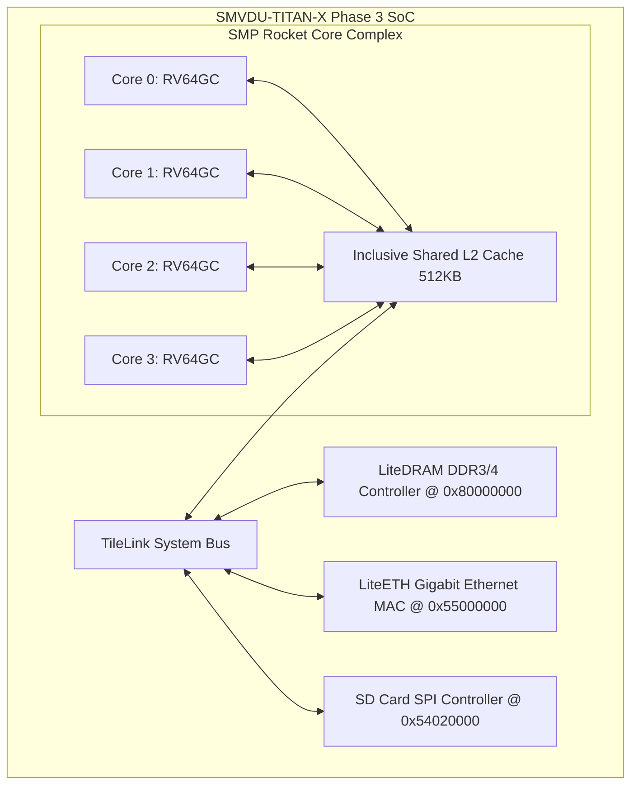

# Phase 3 — Quad-Core coherent Linux Boot

Phase 3 transitions the SMVDU-TITAN-X SoC from basic boot infrastructure to a fully capable multicore SMP computer architecture capable of booting a complete Linux Supervisor kernel.

---

## 1. Architectural Highlights

*   **Processor Complex**: A 4-Hart symmetric multiprocessing (SMP) cluster utilizing RV64GC Rocket Cores.
*   **Coherence System**: Hardware-managed cache coherence across private L1 instruction/data caches mediated by a shared, inclusive 512 KB TileLink L2 Cache.
*   **External High-Speed Subsystems**:
    *   **LiteDRAM DDR Controller**: Maps a 2 GB physical address window starting at `0x8000_0000` for physical DDR3/DDR4 memory chips.
    *   **LiteETH Gigabit Ethernet MAC**: Interfaced via TileLink, providing a RMII/RGMII interface mapped at `0x5500_0000` for physical RJ45 network links.
    *   **SD Card SPI Controller**: Operates SD memory storage via a SPI channel mapped at `0x5402_0000`.



---

## 2. Chipyard Configuration Traits

The multicore SoC layout is registered under the `chipyard` package:

```scala
class TitanXPhase3Config extends Config(
  new freechips.rocketchip.subsystem.WithInclusiveCache ++                             // Coherent L2 Cache
  new chipyard.config.WithGPIO(address = 0x54010000, width = 32) ++                    // GPIO Controller
  new chipyard.config.WithSPIFlash(address = 0x10030000, fAddress = 0x20000000) ++     // SPI Flash Controller
  new freechips.rocketchip.rocket.WithNHugeCores(4) ++                                 // Quad-Core RISC-V Rocket Core
  new chipyard.config.AbstractConfig                                                   // baseline system
)
```

---

## 3. Software Boot Sequence

SMP Linux boot requires a multi-stage software stack loaded from SD Card SPI storage:

1.  **BootROM (FSBL)**: Hard-coded first stage bootloader performing clock configuration and jumping to SPI Flash.
2.  **OpenSBI (Supervisor Binary Interface)**: Mediates supervisor-mode calls for the Linux kernel, initialized to manage `TITAN_X_NUM_HARTS = 4`.
3.  **U-Boot**: Second-stage bootloader loaded into DDR DRAM, executing filesystem commands to mount the SD card ext4 partition.
4.  **Linux 6.x Kernel**: The RISC-V supervisor kernel mounts the compiled BusyBox minimal rootfs and launches the initial console login shell (`/bin/sh`).
