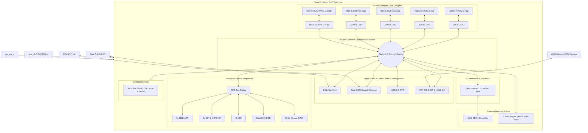

# SMVDU-TITAN-X — Final Integration Phase (Unified SoC)

This sandbox directory contains the completely integrated, silicon-ready, synthesizable **SMVDU-TITAN-X** System-on-Chip (SoC) microarchitecture. It merges all components developed across prior phases into a single unified multicore design, optimized for physical semiconductor implementation on the **6-Metal Layer SCL 180nm CMOS technology node**.

---

## 1. Unified SoC Microarchitecture

---

## 2. Integrated SoC Specifications

| Specification | Target Parameter |
| :--- | :--- |
| **Architecture** | 64-bit RISC-V Multicore SoC |
| **Fabrication Node** | SCL 180nm CMOS (6-Metal Layer) |
| **Operating Frequency**| 125 MHz – 200 MHz (constrained by physical limits) |
| **Application Cores** | **4x RV64GC** (SiFive U54 equivalent) with branch prediction, ALU, and FPU |
| **Monitor Core** | **1x RV64IMAC** (SiFive E51 equivalent) with DTIM scratchpads |
| **L1 Instruction Cache**| 32 KB I-Cache (8-way, SECDED ECC protection) per core |
| **L1 Data Cache** | 32 KB D-Cache (8-way, SECDED ECC protection) per core |
| **Level 2 Shared Cache**| **2 MB** (16-way), banked into 4x 512KB SRAM cells, LIM configurable |
| **Memory Management** | Sv39 MMU (39-bit virtual, 38-bit physical address translation) |
| **High-Speed I/O** | PCIe Gen2 (x4), Dual Gigabit Ethernet MACs (GEM 0 & 1), USB 2.0 OTG |
| **Multimedia Pipeline**| MIPI CSI-2 Input Decoder, ISP unit, Video DMA (VDMA), HDMI 1.4 Controller |
| **Low-Speed Interfaces**| 5x MMUARTs, 2x SPI, 2x I2C, 2x CAN 2.0B, QSPI XIP |
| **Security & Boot** | 128KB eNVM Secure Boot ROM, Cryptoprocessor (AES/SHA/ECDSA), TRNG |

---

## 3. Hierarchical Block Breakdown

The SoC layout is strictly partitioned into high-level sub-systems:

### 1.0 CPU Core Complex (Compute Subsystem)
*   **1.1 Application Cores (x4)**: High-performance 5-stage scalar pipelines with Gshare branch predictors, IEEE-754 FPU, and Sv39 MMU.
*   **1.2 Monitor Core (x1)**: Dedicated secure controller hart running independent RV64IMAC pipeline with private 16KB I-Cache / 8KB DTIM.
*   **1.3 Core Interconnect**: Hardware cached-coherent TileLink Coherent (TileLink-C) crossbar switch.
*   **1.4 Interrupts**: Platform Level Interrupt Controller (PLIC) routing all 186 global IRQs and CLINT timers.
*   **1.5 Debug Module**: Standard JTAG boundary interface.

### 2.0 Memory Subsystem
*   **2.1 L1 Caches**: SECDED ECC-protected SRAM banks.
*   **2.2 L2 Cache**: Directory-Based coherency manager with 4x 512KB banked physical memory cells.
*   **2.3 Memory Controller**: AXI4 DDR4 translation layers and physical PHY pad interfaces.

### 3.0 System Interconnect & Bridges
*   **3.1 Central AMBA Switch**: 15-Master, 9-Slave Arbitration Crossbar with Quality of Service (QoS) metrics.
*   **3.2 Bridges**: High-performance AXI4-to-AHB-Lite and low-power AHB-to-APB converters.

### 4.0 High-Speed I/O (AXI/AHB Masters)
*   **4.1 PCIe Subsystem**: PCIe Gen2 x4 transaction and link controller with PIPE physical interface.
*   **4.2 Gigabit Ethernet**: Dual GEM MACs with RGMII interfaces.
*   **4.3 Video Pipeline**: MIPI CSI-2 receiver, Image Signal Processor (De-Bayer, color scalar), and HDMI 1.4 TMDS output drivers.
*   **4.4 storage & OTG**: SD/MMC controller, USB 2.0 ULPI controller, and QSPI flash.

### 5.0 Low-Speed Peripherals (APB Slaves)
*   Routes register transfers to low-speed interfaces: 5x MMUARTs, 2x SPI, 2x I2C, dual CAN 2.0B, and a 32-bit GPIO pin multiplexer.

### 6.0 Security & Boot Subsystem
*   **6.1 Boot Logic**: 128KB eNVM Flash memory controller and secure bootloader ROM.
*   **6.2 User Crypto-Processor**: Hardware coprocessor for AES-256 block ciphers, SHA-3 compression hashing, ECDSA signatures, and a hardware TRNG.

---

