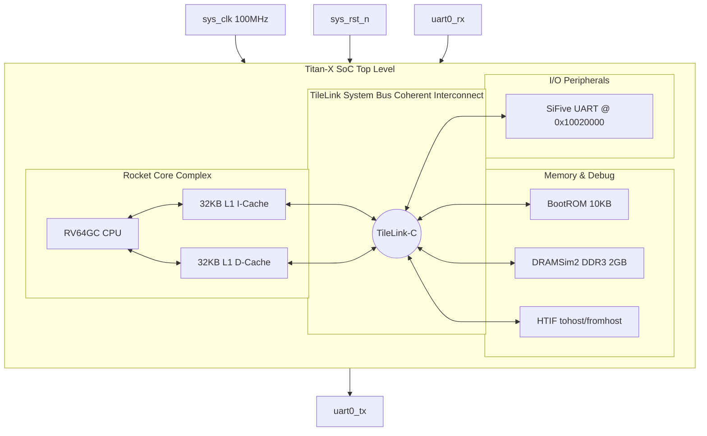

# SMVDU-TITAN-X — Phase 1: Bare-Metal Bring-Up

[](#final-results)
[](#architecture-overview)
[](#simulation-flow)

Phase 1 establishes the baseline processing node for the **SMVDU-TITAN-X** SoC. It integrates a single, high-performance **RISC-V Rocket core** (RV64GC) with primary bare-metal peripherals (SiFive UART, BootROM, and SimDRAM), simulated and validated in Verilator and Spike.

---

## Architecture Overview




---

## Directory Structure

```
smvdu-titan-x-phase1/
├── README.md                   ← Phase overview & quick start
├── RESULTS.md                  ← Simulation & compliance test reports
├── STRUCTURE.md                ← Directory structure breakdown
├── docs/
│   ├── block_diagram.md        ← Architectural block diagrams (Mermaid)
│   ├── memory_map.md           ← Complete physical memory layout
│   ├── design_spec.md          ← Configuration and parameters
│   └── changelog.md            ← Version history
├── rtl/
│   └── top/
│       └── titan_x_top.v       ← Golden top-level integration stub
├── config/
│   └── TitanXPhase1Config.scala ← Chipyard Scala configuration class
├── firmware/
│   ├── hello_uart/             ← Hello World boot banner assembly firmware
│   └── exit_test/              ← Fast smoke-test exit firmware
└── scripts/
    ├── build_sim.sh            ← Builds the Verilator simulator binary
    ├── run_sim.sh              ← Runs simulation tests
    └── run_tests.sh            ← Runs the ISA validation suite
```

For a comprehensive explanation, see [STRUCTURE.md](STRUCTURE.md).

---

## Quick Start

### 1. Prerequisites
Ensure you have the RISC-V GNU toolchain and the Chipyard conda environment active:
```bash
conda activate chipyard
export PATH=$PATH:/path/to/riscv64-unknown-elf/bin
```

### 2. Build the Simulator
Compile the customized Verilator simulator based on the `TitanXPhase1Config` specification:
```bash
bash scripts/build_sim.sh
```

### 3. Run Bare-Metal Firmware
Execute the quick smoke test (exit-only, exits in ~11s):
```bash
bash scripts/run_sim.sh --test=exit
```

Execute the full UART test (compiles the firmware, boots, prints the hello banner, and exits):
```bash
bash scripts/run_sim.sh --test=uart
```

### 4. Run ISA Compliance Suite
Validate the Rocket core RTL correctness against 72 standardized RISC-V compliance test vectors (62 Spike, 10 Verilator):
```bash
bash scripts/run_tests.sh --all
```

---

## Final Results

All validation runs succeeded with zero errors:
*   **exit_test**: Pass (`$finish` via HTIF tohost in 99,392 cycles, ~11s execution).
*   **hello_uart**: Pass (Successfully prints the banner to the console and exits).
*   **ISA Compliance**:
    *   **Spike Functional Sim**: **62/62 PASS**
    *   **Verilator RTL Sim**: **10/10 PASS**

For full execution transcripts, logs, and trace logs, see [RESULTS.md](RESULTS.md).
