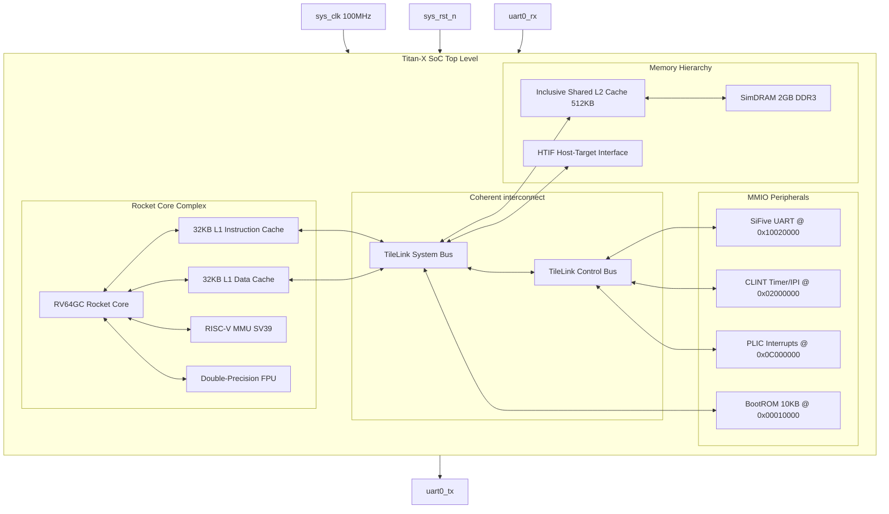

# SMVDU-TITAN-X — Phase 1: Architectural Block Diagram

This document contains the structural block diagrams for the SMVDU-TITAN-X Phase 1 bare-metal processor.

---

## 1. High-Level SoC Block Diagram

The block diagram below represents the exact system hierarchy of the custom generated RISC-V SoC:

---

## 2. Bus Architecture and Address Domains

*   **TileLink-C (Coherent)**: Links L1 Instruction and Data caches to the shared L2 Cache. Manages hardware-enforced cache coherency.
*   **TileLink-UH (Uncached High-performance)**: Standard non-coherent bridge interfacing the BootROM and high-speed memory spaces.
*   **TileLink-UL (Uncached Light-weight)**: Feeds MMIO control buses for lower-speed registers such as UART, CLINT, and PLIC.
