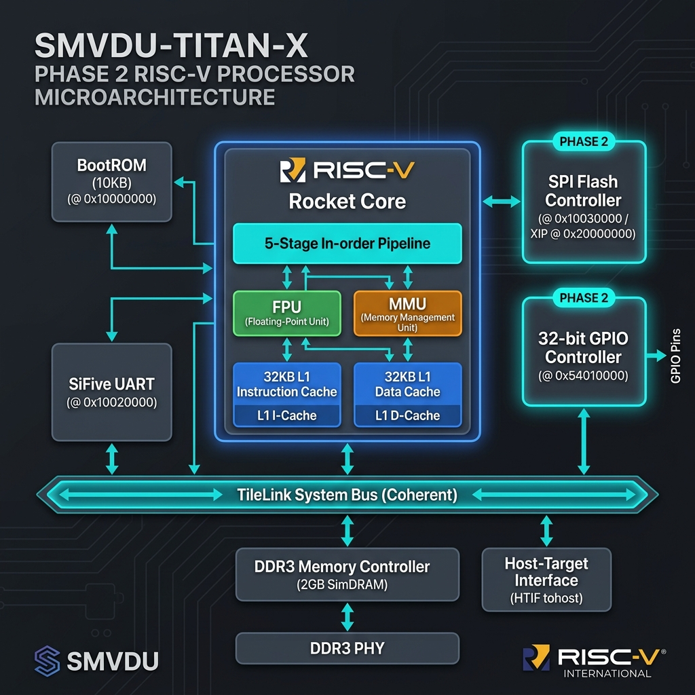
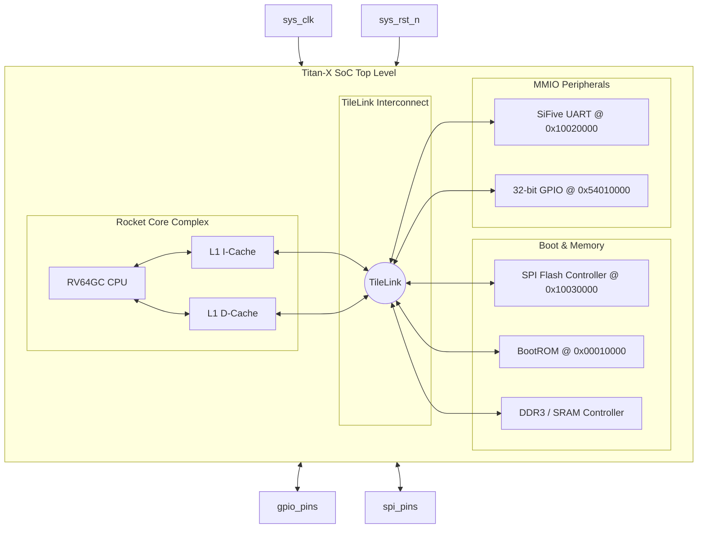

# SMVDU-TITAN-X — Phase 2: Boot Infrastructure

[](#overview)
[](#overview)
[](#overview)

Phase 2 builds upon the bare-metal foundation of Phase 1 to introduce a standardized boot sequence. It integrates an **SPI Flash Controller**, standard M-Mode boot firmware (**OpenSBI**), and a **GPIO controller**.

---

## Architecture Overview

Below is the verified microarchitecture block diagram of the SMVDU-TITAN-X Phase 2 RISC-V SoC:



---

## Core Topology and Bus Interconnect



---

## Directory Structure

```
smvdu-titan-x-phase2/
├── README.md                   # Phase overview & status
├── RESULTS.md                  # Verification plan & metrics
├── STRUCTURE.md                # Submodule folder explanation
├── docs/
│   ├── block_diagram.md        # Architectural schematics
│   ├── memory_map.md           # Address assignments (SPI, GPIO added)
│   └── design_spec.md          # Interface descriptions
├── rtl/
│   ├── peripherals/
│   │   └── titan_x_gpio.v      # GPIO Controller RTL stub
│   └── top/
│       └── titan_x_top.v       # Top Level SoC including SPI/GPIO
├── config/
│   └── TitanXPhase2Config.scala # Chipyard configuration recipe
├── firmware/
│   └── bootrom/                # OpenSBI and bootloader assembly stubs
└── verification/
    └── testbench/
        └── tb_titan_x_phase2.sv # SystemVerilog top testbench
```
