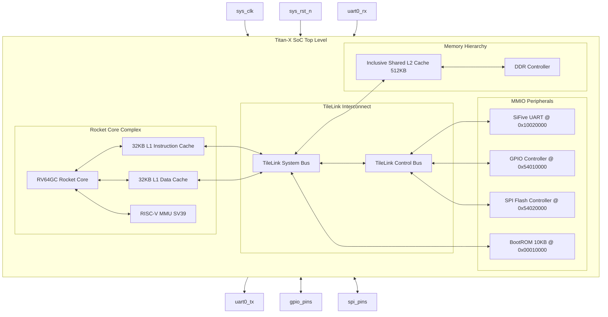

# SMVDU-TITAN-X — Phase 2: Architectural Block Diagram

This document contains the structural block diagrams for the SMVDU-TITAN-X Phase 2 SoC.

---

## 1. SoC Block Diagram

The block diagram below represents the system hierarchy of Phase 2, highlighting the addition of SPI and GPIO controllers:

