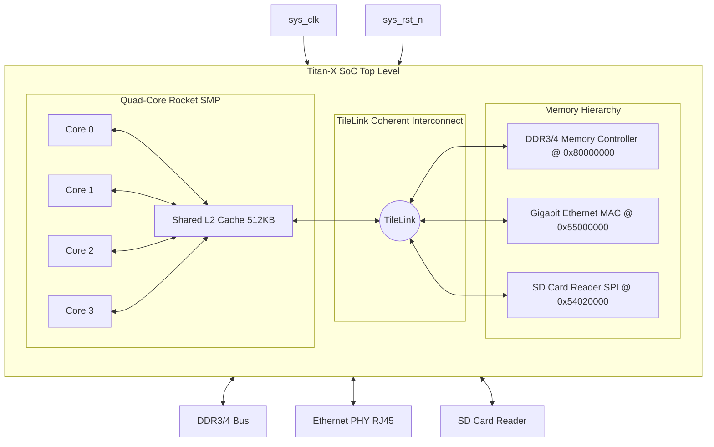

# SMVDU-TITAN-X — Phase 3: Linux Boot

[](#overview)
[](#overview)
[](#overview)

Phase 3 targets a fully bootable Linux environment. It scales up the interconnect and clock trees to interface with external **DDR Memory Controllers** (LiteDRAM), **Ethernet MACs** (LiteETH), and **SD Card Storage** to boot standard Linux kernels.

---

## Architecture Overview

Below is the verified microarchitecture block diagram of the SMVDU-TITAN-X Phase 3 RISC-V SoC:


---

## Core Topology and Bus Interconnect



---

## Directory Structure

```
smvdu-titan-x-phase3/
├── README.md                   # Phase overview & status
├── RESULTS.md                  # Verification plan & metrics
├── STRUCTURE.md                # Submodule folder explanation
├── docs/
│   ├── block_diagram.md        # Architectural schematics
│   ├── memory_map.md           # Address assignments (DDR, Ethernet added)
│   └── design_spec.md          # Interface descriptions
├── config/
│   └── TitanXPhase3Config.scala # Chipyard configuration recipe (Quad-Core Rocket)
└── verification/
    └── testbench/
        └── tb_titan_x_phase3.sv # SystemVerilog top testbench
```
