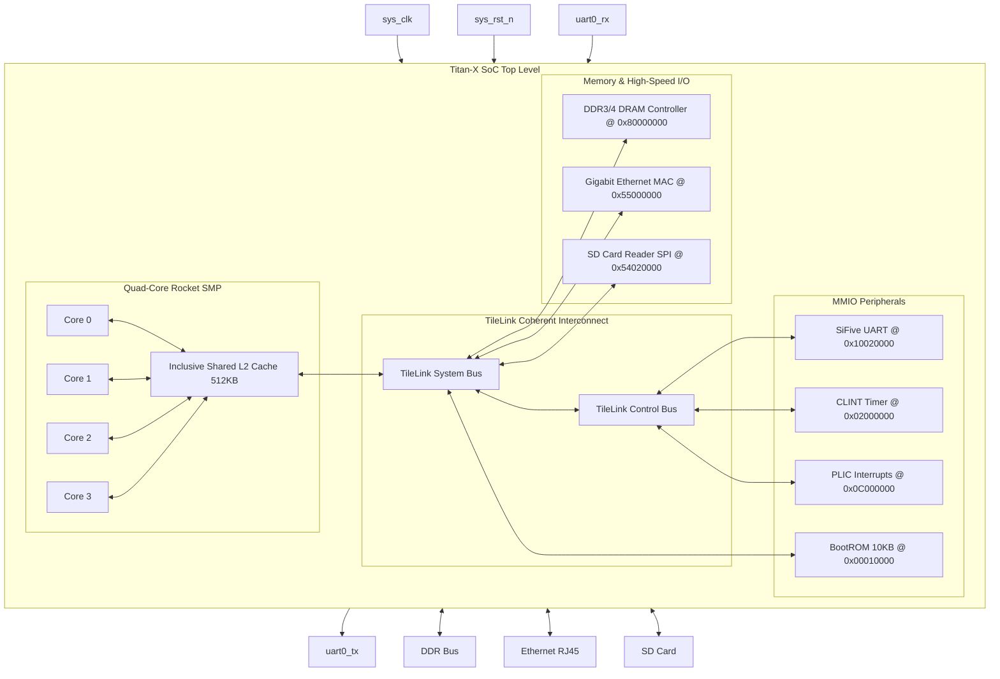

# SMVDU-TITAN-X — Phase 3: Architectural Block Diagram

This document contains the structural block diagrams for the SMVDU-TITAN-X Phase 3 SoC.

---

## 1. SoC Block Diagram

The block diagram below represents the system hierarchy of Phase 3, highlighting the shared L2 cache and external memory controllers:

