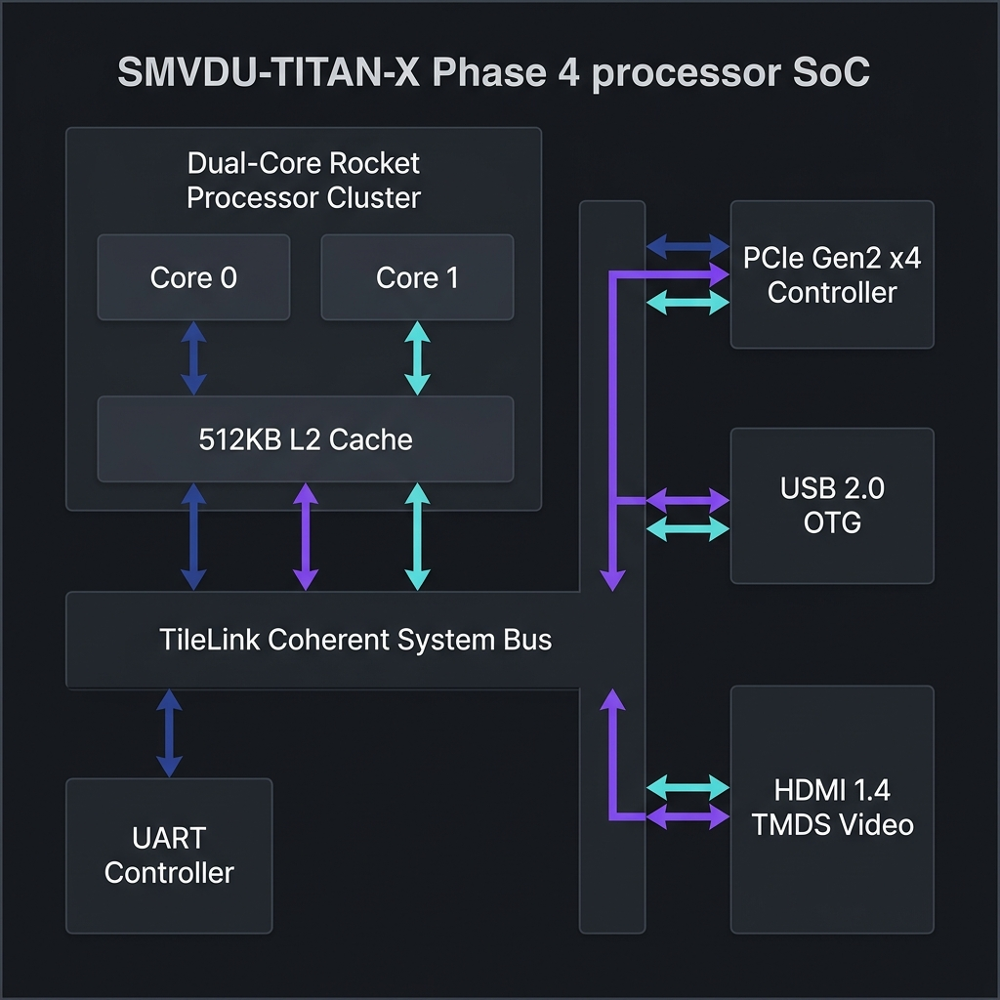
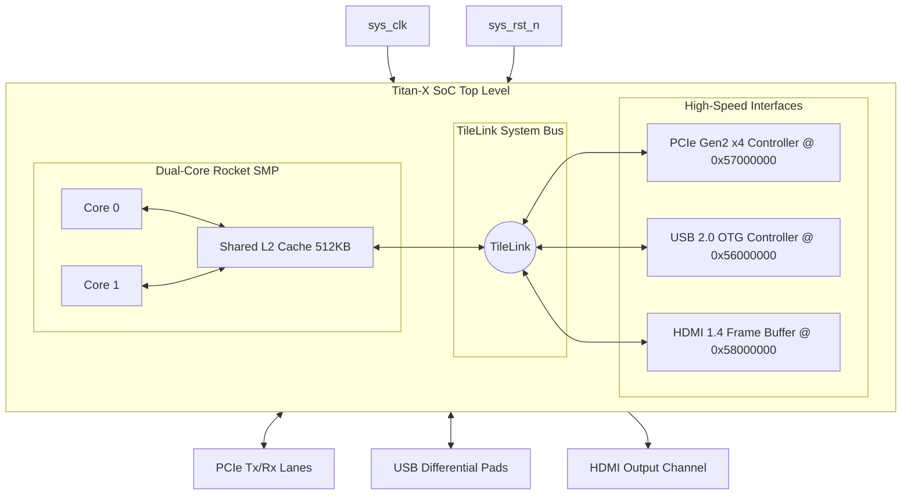

# SMVDU-TITAN-X — Phase 4: High-Speed I/O

[](#overview)
[](#overview)
[](#overview)

Phase 4 expands the physical system interface scope by integrating high-speed communication blocks: **PCIe Gen2 Controller**, **USB 2.0 OTG Controller**, and **HDMI Display Controller**, operating on an upgraded coherent dual-core CPU topology.

---

## Architecture Overview





---

## Directory Structure

```
smvdu-titan-x-phase4/
├── README.md                   # Phase overview & status
├── RESULTS.md                  # Verification plan & metrics
├── STRUCTURE.md                # Submodule folder explanation
├── docs/
│   ├── block_diagram.md        # Architectural schematics
│   └── design_spec.md          # Interface descriptions
├── config/
│   └── TitanXPhase4Config.scala # Chipyard configuration recipe (Dual-Core Rocket)
└── verification/
    └── testbench/
        └── tb_titan_x_phase4.sv # SystemVerilog top testbench
```
