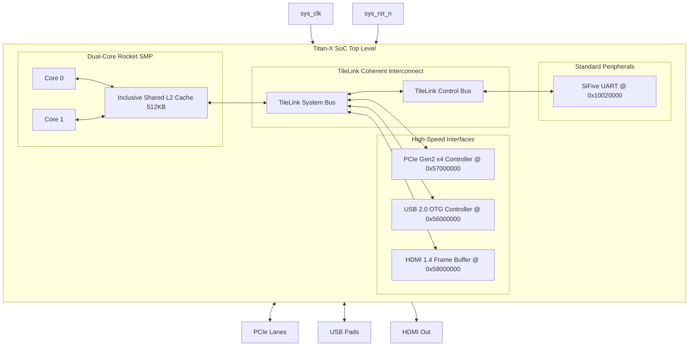

# SMVDU-TITAN-X — Phase 4: Architectural Block Diagram

This document contains the structural block diagrams for the SMVDU-TITAN-X Phase 4 SoC.

---

## 1. SoC Block Diagram

The block diagram below represents the system hierarchy of Phase 4, highlighting the PCIe, USB and HDMI controllers:

