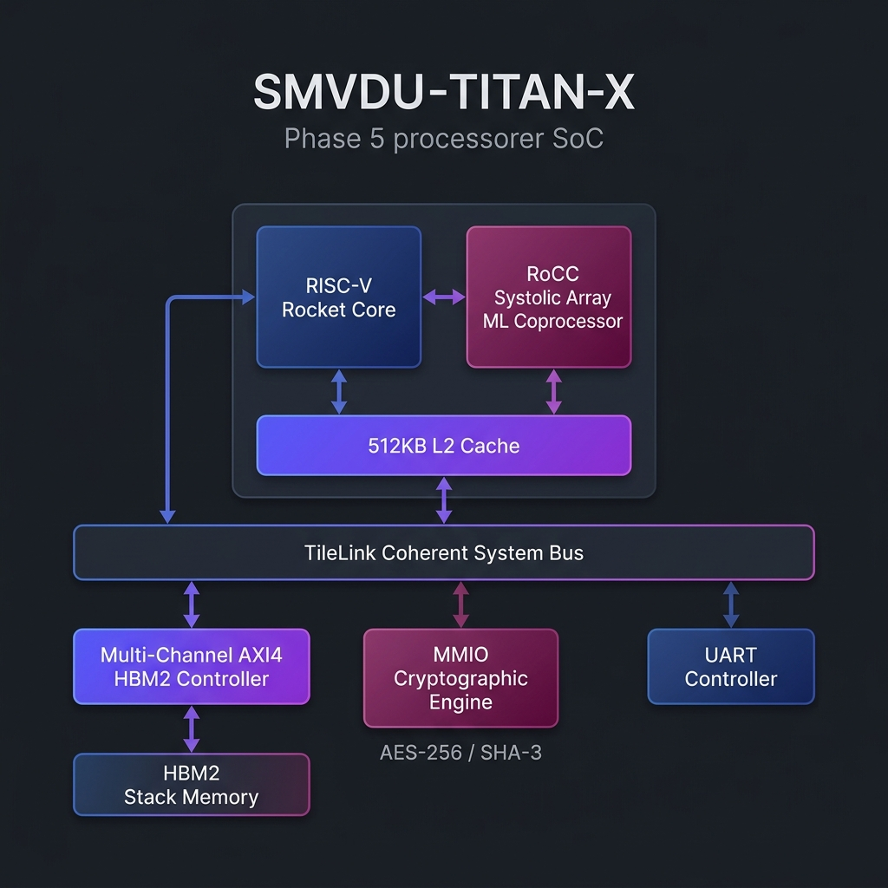
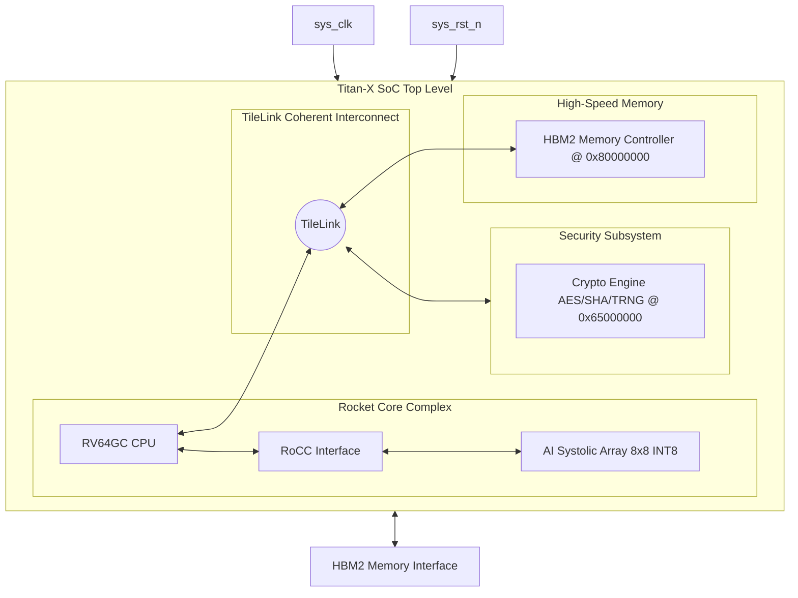

# SMVDU-TITAN-X — Phase 5: Acceleration Engine

[](#overview)
[](#overview)
[](#overview)

Phase 5 represents the peak computational capability of the SMVDU-TITAN-X processor, targeted for ASIC and advanced FPGA systems. It integrates custom **AI/ML Systolic Array Coprocessors** via the Rocket Custom Coprocessor (RoCC) interface and dedicated **Cryptographic Hardware Accelerators** (AES-256, SHA-3, TRNG).

---

## Architecture Overview





---

## Directory Structure

```
smvdu-titan-x-phase5/
├── README.md                   # Phase overview & status
├── RESULTS.md                  # Verification plan & metrics
├── STRUCTURE.md                # Submodule folder explanation
├── docs/
│   ├── block_diagram.md        # Architectural schematics
│   └── design_spec.md          # Interface descriptions
├── config/
│   └── TitanXPhase5Config.scala # Chipyard configuration recipe (RoCC Custom Accelerator)
└── verification/
    └── testbench/
        └── tb_titan_x_phase5.sv # SystemVerilog top testbench
```
