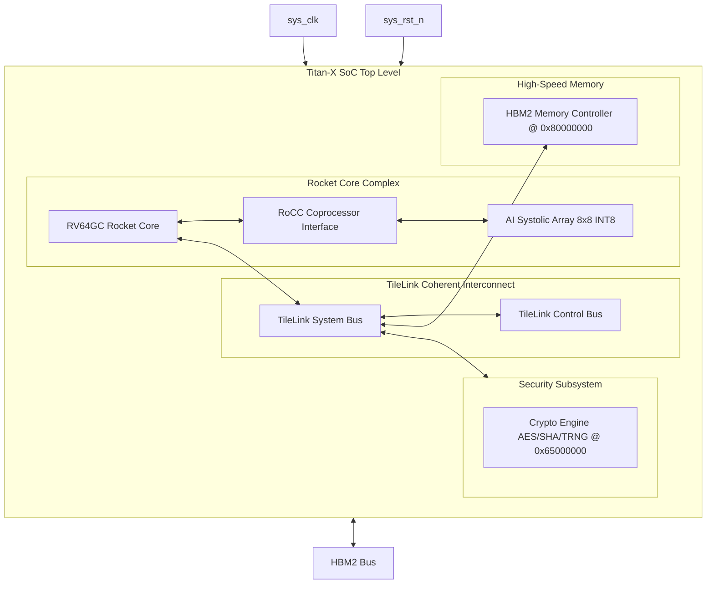

# SMVDU-TITAN-X — Phase 5: Architectural Block Diagram

This document contains the structural block diagrams for the SMVDU-TITAN-X Phase 5 SoC.

---

## 1. SoC Block Diagram

The block diagram below represents the system hierarchy of Phase 5, highlighting the custom RoCC coprocessor and security block:

